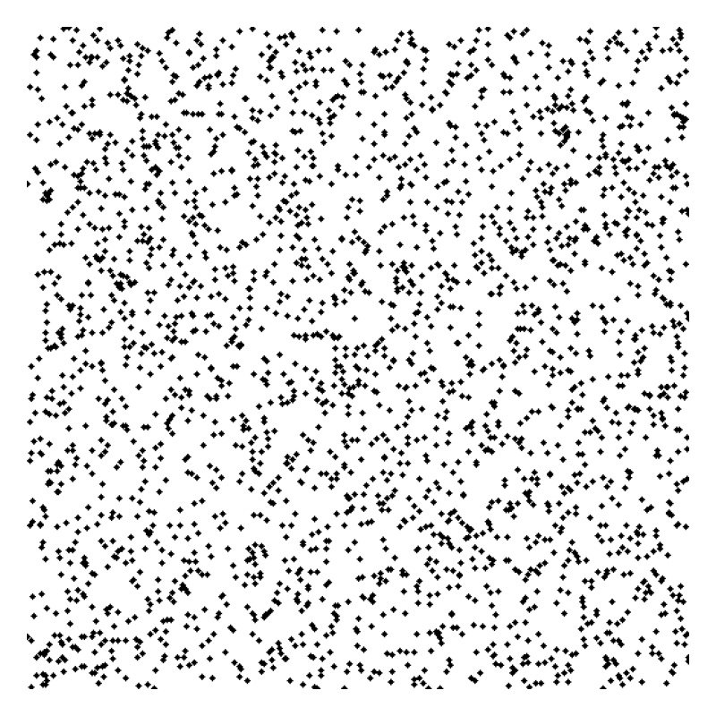

## Overview

This page provides a **minimal educational model** for understanding  
the fundamental trade-off in inkjet printing:

- **Print quality**
- **Printing speed**

The model is intentionally simplified to focus on **design causality**,  
not on reproducing real printers.

---

## Dominant axes (D–T–S)

Inkjet printing behavior can be organized using three dominant axes:

- **D — Drop density**  
  Number of ink drops per unit area  
  → affects graininess and perceived image quality

- **T — Throughput**  
  Ink ejection capability per unit time  
  → limits achievable printing speed

- **S — Spread**  
  Dot spread on media (ink + paper interaction)  
  → controls sharpness vs bleeding

Most practical parameters (dpi, passes, drop size, colors, nozzle count)  
can be reduced to combinations of these three axes.

---

## Visualization examples

### Graininess vs quality

**Lower drop density (FAST)**

**Higher drop density (HIGH QUALITY)**

---

### Dot spread effect

**Small dot (sharp)**

**Large dot (bleeding)**

---

## Notes

- The images shown above are **synthetic visualizations**, not real print data.
- They are intended to make qualitative differences **visually obvious**.
- Numerical accuracy and product-specific behavior are out of scope.

---

## Purpose

This project is designed to support:

- engineering education
- conceptual design discussions
- explanation of inkjet trade-offs

by keeping the model **simple, executable, and visual**.

